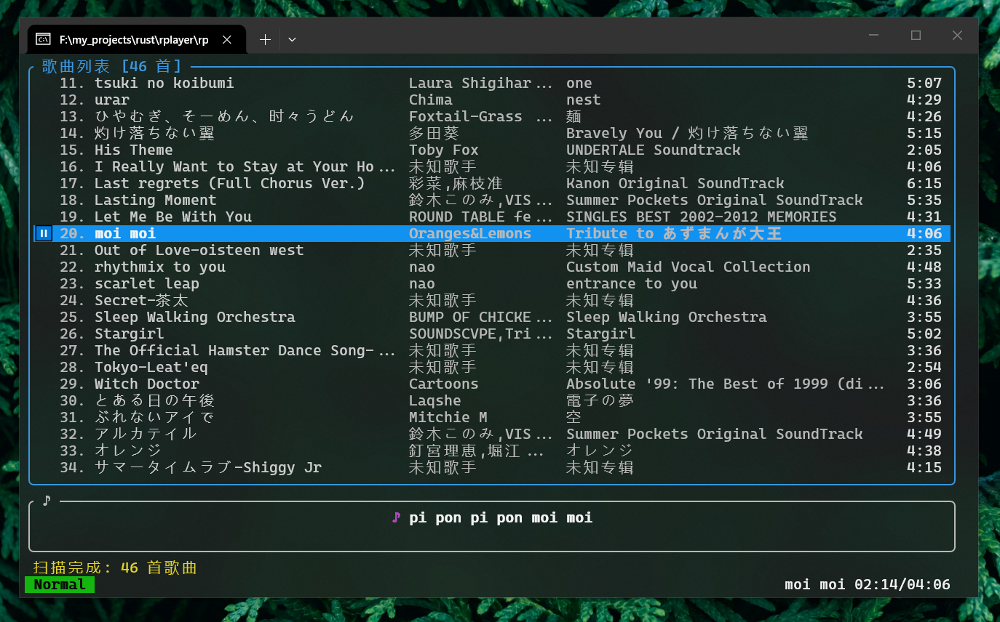
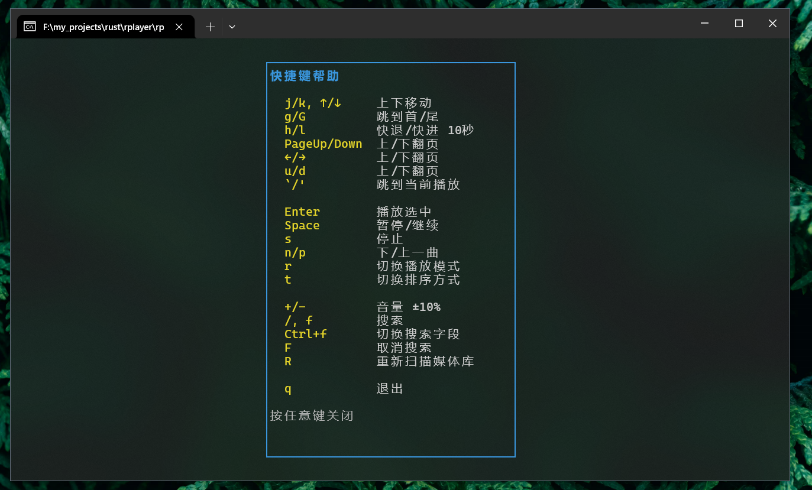

# RPlayer

基于 Rust 的终端音乐播放器，支持歌词显示和 Vim 风格快捷键。

Powered by GLM-5

## 功能特性

- 本地音乐播放，自动扫描媒体库
- 支持 MP3、FLAC、WAV、OGG、AAC 格式
- LRC 歌词同步显示（支持内嵌歌词）
- Vim 风格快捷键操作
- 自定义主题色（边框、标题、选中行背景）
- 播放位置记忆，退出后下次启动自动恢复（暂停状态）

## 截图





## 布局

```
┌─────────────────────────────────────────┐
│                                         │
│           播放列表 (Playlist)            │  ← 自适应高度 (Min 5)
│                                         │
│                                         │
├─────────────────────────────────────────┤
│           歌词 (Lyrics)                 │  ← 固定 4 行高
├─────────────────────────────────────────┤
│           消息栏 (Message)              │  ← 固定 1 行高
├─────────────────────────────────────────┤
│           状态栏 (Statusbar)             │  ← 固定 1 行高
└─────────────────────────────────────────┘
```

## 安装

### 从源码编译

```bash
# 克隆项目
git clone <repo-url> rplayer
cd rplayer

# 编译
cargo build --release

# 运行
./target/release/rplayer
```

## 使用方法

### 启动

直接运行即可，程序会自动扫描音乐目录：

- 如果通过 `-d` 指定了目录，使用该目录
- 否则读取配置文件中的设置
- 如果都没有，使用系统默认音频目录

### 快捷键

#### 导航

所有导航命令(除`G`、`` ` ``、`'` 外)均支持数字前缀（如 `5j` 向下移动 5 行，`10g` 跳转到第 10 行）。

| 按键 | 功能 |
|------|------|
| `j` / `↓` | 向下移动 |
| `k` / `↑` | 向上移动 |
| `d` / `PgDn` / `→` | 向下翻页 |
| `u` / `PgUp` / `←` | 向上翻页 |
| `g` | 跳到顶部 |
| `G` | 跳到底部 |
| `` ` `` / `'` | 跳到当前播放歌曲 |

#### 播放控制

| 按键 | 功能 |
|------|------|
| `Enter` | 播放选中歌曲（支持数字前缀） |
| `Space` | 暂停/继续 |
| `n` | 下一首 |
| `p` | 上一首 |
| `h` | 快退 10 秒 |
| `l` | 快进 10 秒 |

#### 音量

| 按键 | 功能 |
|------|------|
| `+` / `=` | 音量 +10% |
| `-` | 音量 -10% |

#### 排序

| 按键 | 功能 |
|------|------|
| `t` | 切换排序方式 |

排序方式循环：歌曲名 → 歌手 → 专辑 → 文件夹 → 歌曲名

#### 播放模式

| 按键 | 功能 |
|------|------|
| `r` | 切换播放模式 |

播放模式循环：顺序播放 → 单曲循环 → 列表循环 → 随机播放 → 顺序播放

#### 搜索

| 按键 | 功能 |
|------|------|
| `f` / `/` | 进入搜索模式 |
| `Ctrl+f` | 切换搜索字段 |
| `Esc` | 退出搜索（清除过滤） |
| `Enter` | 确认搜索 |
| `F` | 清除当前过滤(Normal模式下) |

搜索字段循环：歌曲/歌手 → 歌手 → 专辑 → 文件名 → 歌曲/歌手

搜索支持实时过滤，输入时即时显示匹配结果。

#### 其他

| 按键 | 功能 |
|------|------|
| `R` | 重新扫描媒体库（后台执行） |
| `T` | 修改主题色 |
| `S` | 切换媒体库文件夹 |
| `?` | 显示帮助 |
| `q` / `Ctrl+C` | 退出 |

## 配置

配置文件 `config.toml` 
- windows自动生成在可执行文件同目录下
- linux, macos 自动生成在 `~/.rplayer/` 目录下

```toml
music_folder = "/path/to/music"
# 主题色，6位十六进制（如 "56B6C2"），留空使用默认颜色
themecolor = ""
# 排序方式：Title（歌曲名）、Artist（歌手）、Album（专辑）、Folder（文件夹）
sort_mode = "Title"
# 以下字段由程序自动维护，无需手动编辑
last_song_path = ""
last_position_secs = 0
```

### 主题色

按 `T` 进入主题色输入模式：

- 输入 6 位十六进制颜色值（如 `56B6C2`），可选加 `#` 前缀

## 播放恢复

程序退出时自动保存当前播放的歌曲路径和播放进度（秒）

## 歌词

歌词加载优先级：
1. 外部 LRC 文件：与音乐文件同目录、同名、`.lrc` 后缀
2. 内嵌歌词：从音频文件的元数据中读取（支持 ID3v2、Vorbis Comments 等）

歌词格式需为标准 LRC 格式，支持时间标签同步显示。


## 缓存机制

为加快启动速度，RPlayer 使用 JSON 缓存：

- 首次启动：全量扫描，解析所有文件元数据
- 后续启动：加载缓存 → 后台增量扫描（仅解析新增/修改的文件）
- 缓存文件存储在 `cache/` 文件夹中
  - Linux / macOS：`~/.rplayer/cache/`
  - Windows：与可执行文件同目录的 `cache/`
- 通过文件修改时间（mtime）判断是否需要重新解析

## 技术栈

| 组件 | 技术 |
|------|------|
| TUI 框架 | [ratatui](https://github.com/ratatui/ratatui) + [crossterm](https://github.com/crossterm-rs/crossterm) |
| 音频解码与元数据解析 | [rodio](https://github.com/RustAudio/rodio) + [symphonia](https://github.com/pdeljanov/Symphonia) |
| 并行处理 | [rayon](https://github.com/rayon-rs/rayon) |
| 命令行解析 | [clap](https://github.com/clap-rs/clap) |

## 依赖

- Rust 1.75+
- ALSA (Linux，通常系统自带)

## License

MIT
